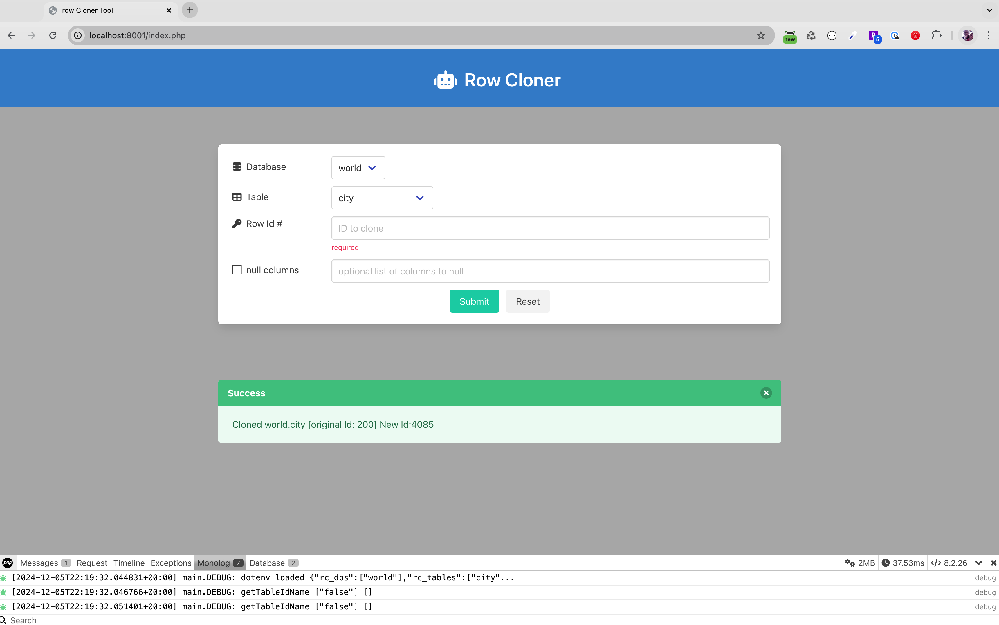

# rowcloner: Relational database row cloning tool #

This tool began life as a simple proof of concept, based on a [question posed in the phpfreaks.com](https://forums.phpfreaks.com/topic/315930-writing-to-m) forums.

- The tool provides a web interface to select a row in a table by id.
- It selects that row, and empties the id value
- Other columns to null can be set optionally
- It then inserts that row back into the table

This project uses the Doctrine DBAL layer.  

NOTE: DBAL requires PDO and MySQL/Mariadb support.

It was meant to be a quick and dirty proof of concept, created in minimal time.  There is limited error checking and no real security.  If you want to actually use this tool, you will need to secure it from the world using some other method.  

You can run it locally under Docker or as a development project, or on an intranet if you find it useful. The original user who posted the question was probably creating a development tool to manipulate test data.

As databases typically have relationships, unique indexes and the like, this tool isn't designed to take database constraints into account, and will fail with an error in those cases.  So long as the debugging is turned on a log in the /log directory will be written.

## Configuration ##
Create a .env.local file copied/based on the .env.local.template file provided.  Change the relevant database connection variables as needed.  Examine the comments and variables for help.

## Environment Setup ##

Run this in the project directory:
```
composer install
```
This should work with the php local server, and was designed and tested using the symfony cli.

Also Run from the project directory:

```
symfony server:start
```

With some other web server, make sure to set the webroot to /path/to/rowCloner/public

If you are missing composer or a runtime environment for webserving, see the instructions for using docker below.

## UI ##
I wanted a css framework that was fast and easy to use, and could be included from a CDN.  I used [Bulma](https://bulma.io/)

## Components ##
This project relies primarily on Doctrine DBA, but also uses monolog and symfony dotenv.  Just as a proof of concept I also added the PHP Debugbar.

## How it was created ##
This project used a number of techniques that PHP developers will typically use
 - started with a composer.json generated via composer --init 
 - public script/files in a /public directory
 - Use of components added via composer require
 - PSR-4 autoloading
 - project files mapped to namespace App/
 - configuration taking advantage of .env.* files
 - Uses a trait for generic shared debug routines
 - html5 markup with a css framework

## Best Trick ##
The nicest trick, is facilitated by Doctrine.  The cloned/duplicate row query is very easy thanks to the [DBAL connection insert method](https://www.doctrine-project.org/projects/doctrine-dbal/en/latest/reference/data-retrieval-and-manipulation.html#insert).

## Design issues ##
There are numerous design issues and ways this could be improved and made more usable.  If you would like to improve it, I'll consider pull requests. You can file issues as well.  I made this on a whim and as a challenge and for practice.  Please keep this in mind.    

## Logging ##
As a quick and dirty proof of concept, this app logs a lot of information both to firephp (if you have that setup in your browser) and to a log file in the log directory.  For example, all db credentials are dumped on every request.  Change RC_DEBUG to false if you want to turn that off.

## Debug Bar integration ##
I integrated [PHP Debug bar](http://phpdebugbar.com/) to show how it could be used in a simple project.  Again, this application is a proof of concept and was not created with security in mind.  A debug bar should be isolated to a development environment, but no efforts were made to do that with phpdebugbar.  

## Using Docker to run a demo Database ##
This package comes with a Dockerfile that installs the [MySQL World Database](https://dev.mysql.com/doc/world-setup/en/) into the latest MariaDB version.  To setup and run this database on your local machine (running at localhost:3306), use these commands from the project directory in your cli.

```
docker build --build-arg DB_PASSWORD=$(cat .env.local | grep DB_PASSWORD | cut -d '=' -f 2) --tag demodb-image ./demodb
```
This should build an image with the world database installed and ready for use.

Run the database using docker run:

```
docker run -d --rm -p 3306:3306 --name demodb demodb-image 
```

NOTE: this will allow connection to the container on MySQL standard port 3306.  If you are already running a local mysql server listening to this port, or tunneling to an external database with 3306 this will conflict.

To use the mysql cli client (now called mariadb) you can connect using the docker exec.  You will be prompted for the password which is 'demodbpw'

```
docker exec -it demodb mariadb -u root -p world
```

You should be able to run queries and mysql standard commands like 'show tables'.

## Using Docker For Setup ##
Should you be missing local components to run this in a full web environment, or using the symfony cli helper, here are instructions for setup and running using docker.

Open a terminal/cli in the project directory and run these commands.

To install dependencies using composer:
```
docker run --rm --interactive --tty --volume $PWD:/app composer install
```

To run an apache/php localhost environment available at port 8001:
```
docker build --tag rowcloner-image ./php
docker run -d -p 8001:80 --name rowcloner-app -v "$PWD/public":/var/www/html -v "$PWD":/var/www rowcloner-image
```

If you have issues with the docker container, you can remove and rerun the command above after fixing any issues:

```
docker stop rowcloner-app
docker rm rowcloner-app
```

## Where are the tests? ##
Yes, this project should have Unit tests.

It was created as proof of concept, in less than a day, start to finish. I did not use a framework, as I wanted this to be minimal and self contained, but a lot of time was wasted on things in the RequestHandler class, that would have been built into a framework like symfony.

If I have some spare time, I might add unit tests, but I have no current plan to do so. With that said, I have written many unit tests and have found them very useful, as they often force re-evaluation of design decisions you make, and when done well, can reveal flaws in the code, insuring quality, and protection against regressions when you make changes.

For ongoing development, unit (and other types of) tests are an indispensible part of the enhancement process, and allow you to maintain quality and find bugs before they go into production.  You also can't take advantage of CI/CD without them.

## Looking to practice unit testing? ##
If you are looking for a way to practice and improve, try forking this repo, making a branch and adding tests.

You need to [require phpunit](https://phpunit.de/getting-started/phpunit-9.html). As of the time this was written in feb of 2023, you would use composer to do that like this.

```
composer require --dev phpunit/phpunit ^9
```
At minimum I would have created tests for these classes
- RequestHandler
- RowCloner


